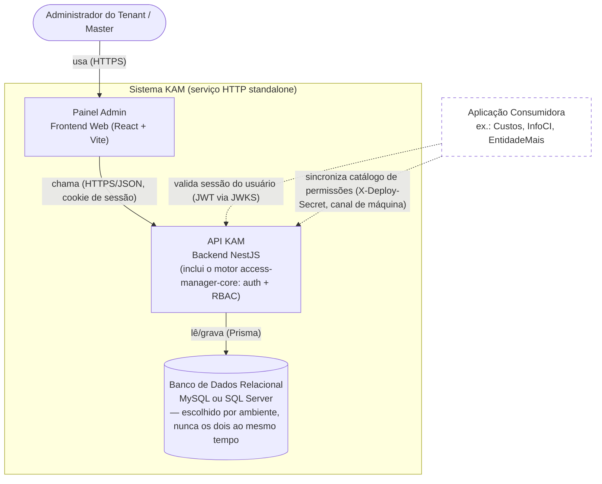
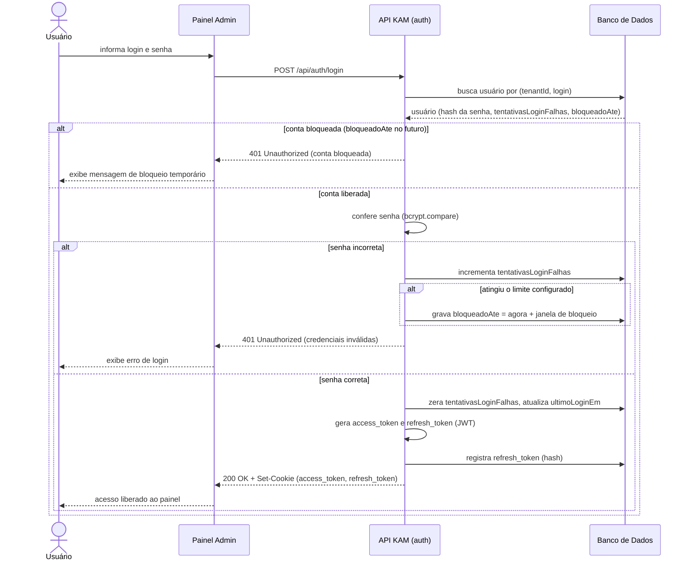

# KAM — Discovery de Arquitetura (Diagrams as Code)

Atividade da Unidade III (AKCIT — Modelagem e Geração de Diagramas com
Linguagem Natural): documentação de descoberta de um sistema real, usando
linguagem natural + GenAI para gerar diagramas versionáveis em Mermaid,
seguindo o fluxo "descrição → lacunas/perguntas → roteiro revisado →
suposições → diagrama → checklist" ensinado na disciplina.

Sistema escolhido: **KAM (Kaue Access Manager)**, um serviço interno de
autenticação e autorização (RBAC) multi-tenant que hoje atende as aplicações
Custos e InfoCI. Este repositório **não contém o código-fonte do KAM** (que é
privado) — é só a documentação de arquitetura produzida a partir dele.

## Sobre o processo

Cada diagrama abaixo tem um roteiro completo em [`docs/`](docs/), com o
prompt de lacunas, as lacunas e perguntas levantadas, o roteiro revisado, as
suposições declaradas antes do código e um checklist de revisão — tudo
como manda o método da aula. Os fontes Mermaid ficam em [`diagrams/`](diagrams/)
e são renderizados abaixo.

## Descrição do sistema

**Escopo**: autenticação e autorização (RBAC) centralizadas para múltiplas
aplicações de uma mesma organização — não inclui a lógica de negócio dessas
aplicações, só quem pode entrar e o que pode fazer.

**Nível desta documentação**: C4 — Containers (estrutural) + sequência
(comportamental), sobre o modo de deploy "serviço HTTP standalone".

**Limites e responsabilidades**: um Painel Admin (frontend) permite cadastrar
tenants, empresas, filiais, usuários, aplicações e permissões; uma API
concentra toda a regra de autenticação e verificação de permissão; o banco
de dados só persiste — nenhuma regra de autorização vive nele.

**Integrações externas**: aplicações consumidoras (Custos, InfoCI,
EntidadeMais) se relacionam com o KAM de duas formas — usuários finais delas
confiam no JWT emitido pelo KAM (validado via JWKS), e a própria aplicação
sincroniza seu catálogo de permissões com o KAM por um canal de máquina
(segredo de deploy), sem sessão de usuário envolvida.

**Restrições**: sessão trafega só por cookie (nunca header/body/query);
banco de dados dual (MySQL ou SQL Server, escolhido por ambiente); modo
"biblioteca" (KAM embutido em outro backend Nest) é uma topologia diferente,
fora do escopo deste diagrama.

**Lacunas conscientes** (ver `docs/` para a lista completa): modo
"biblioteca" não documentado aqui; parâmetros exatos de políticas de negócio
(limite de tentativas de login, duração do bloqueio, TTL de token) não
fixados, só o comportamento.

## Diagrama estrutural — Containers

Roteiro completo: [`docs/roteiro-estrutural.md`](docs/roteiro-estrutural.md) ·
Fonte: [`diagrams/containers.mmd`](diagrams/containers.mmd)

## Diagrama comportamental — Sequência de login

Roteiro completo: [`docs/roteiro-comportamental.md`](docs/roteiro-comportamental.md) ·
Fonte: [`diagrams/login-sequence.mmd`](diagrams/login-sequence.mmd)

## Decisões e ajustes feitos sobre o que o modelo gerou

O que o modelo (seguindo o roteiro da aula) inferiu corretamente:

- A separação entre Painel Admin (frontend) e API (backend) como containers
  distintos, sem eu precisar corrigir nada aí.
- A necessidade de marcar a aplicação consumidora como integração externa,
  já que ela não faz parte do runtime do KAM.
- Que login é uma jornada crítica o bastante para merecer diagrama de
  sequência com caminho de sucesso e de falha.
- Que a estrutura do roteiro (Escopo/Nível/Limites/Integrações/Restrições/
  Lacunas) generaliza bem para um sistema de autenticação, não só para o
  exemplo de e-commerce da aula.

O que precisei ajustar, usando conhecimento real do código-fonte (não dado
no prompt inicial):

- Um modelo genérico tenderia a desenhar "a API" e "o banco" como containers
  óbvios, mas não tem como adivinhar que o KAM tem **dois** motores de banco
  possíveis (MySQL/SQL Server) escolhidos por variável de ambiente, nem que
  a autenticação é **cookie-only** (sem header/body). Tive que declarar isso
  como restrição explícita, senão o diagrama ficaria plausível e errado.
- O canal de **máquina** (`X-Deploy-Secret`) para sincronizar permissões é um
  tipo de integração que um modelo genérico não inventaria sozinho — ele
  tende a assumir que toda comunicação da aplicação consumidora passa pela
  sessão de um usuário. Isso só entrou no diagrama porque eu sabia da
  existência desse endpoint no código.
- A política de bloqueio de conta (quantas tentativas, o que acontece se a
  senha certa chegar durante o bloqueio) é regra de negócio específica que
  o modelo tenderia a "chutar" com um número plausível (3? 5?) sem isso
  estar confirmado — documentei como suposição explícita, nunca como fato.
- Tive que excluir deliberadamente o modo "biblioteca" (`KamModule` embutido
  em outro backend) do diagrama de containers, para não misturar duas
  topologias de deploy diferentes no mesmo desenho — decisão de escopo, não
  limitação da notação.

O que a documentação precisaria ter a mais para um agente construir o
sistema sem inventar decisões:

- Os valores exatos das políticas de negócio (limite de tentativas de login,
  duração do bloqueio, TTL de access/refresh token) — hoje isso vive em
  variáveis de ambiente/código, não em texto legível fora dele.
- O contrato de erro por caminho de falha (401 vs. 403 vs. 429, corpo da
  resposta) — o diagrama mostra que existe uma resposta de erro, não o
  contrato exato.
- Um glossário do catálogo de permissões (quais recursos e ações existem
  hoje, e a convenção de nome `recurso_acao`) — sem isso, um agente que for
  implementar uma tela nova não sabe que convenção seguir.
- As regras de escopo empresa/filial do RBAC (quando o escopo é "any" vs.
  quando precisa casar `empresaId`/`filialId`) — é uma regra específica que
  só está no código-fonte hoje, não em nenhum diagrama estrutural.
- Um diagrama de containers separado para o modo "biblioteca", já que este
  repositório só documenta o modo standalone.

## Reprodução

Os arquivos `.mmd` em [`diagrams/`](diagrams/) são o "diagram as code" —
qualquer editor com suporte a Mermaid (ex.: extensão Mermaid no VS Code, ou
colar o conteúdo em um live editor Mermaid) renderiza sem depender do texto
deste README. 
